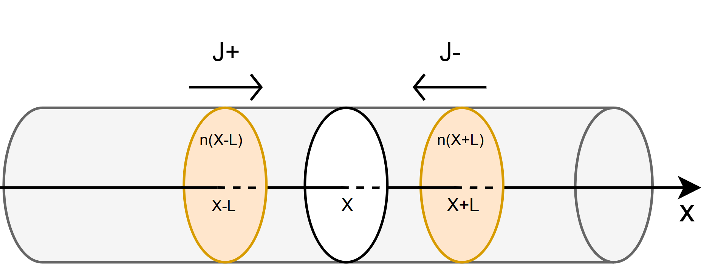
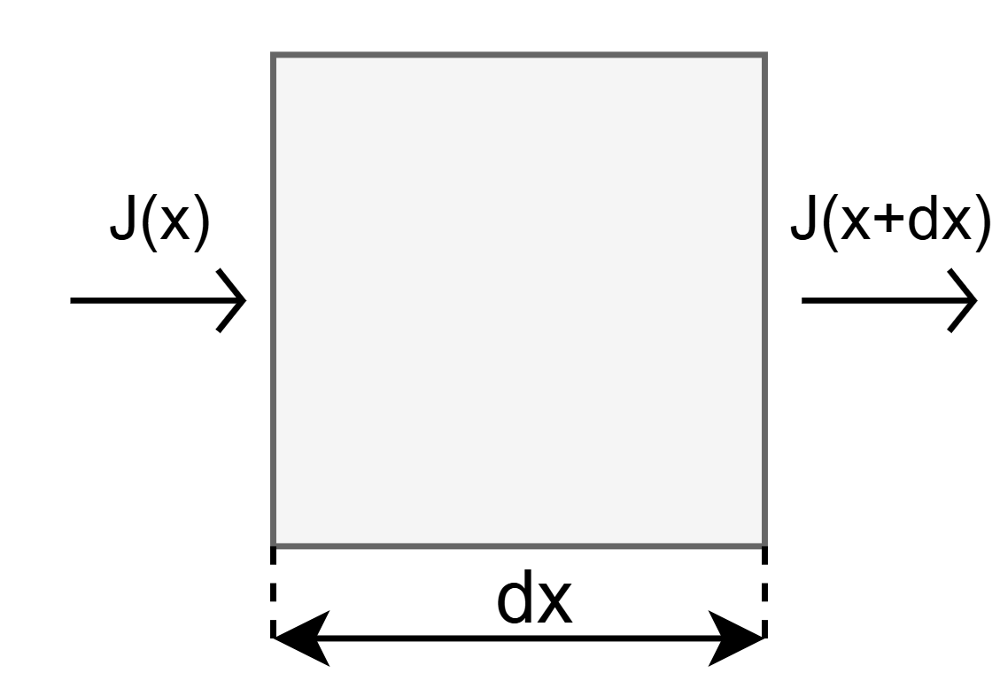
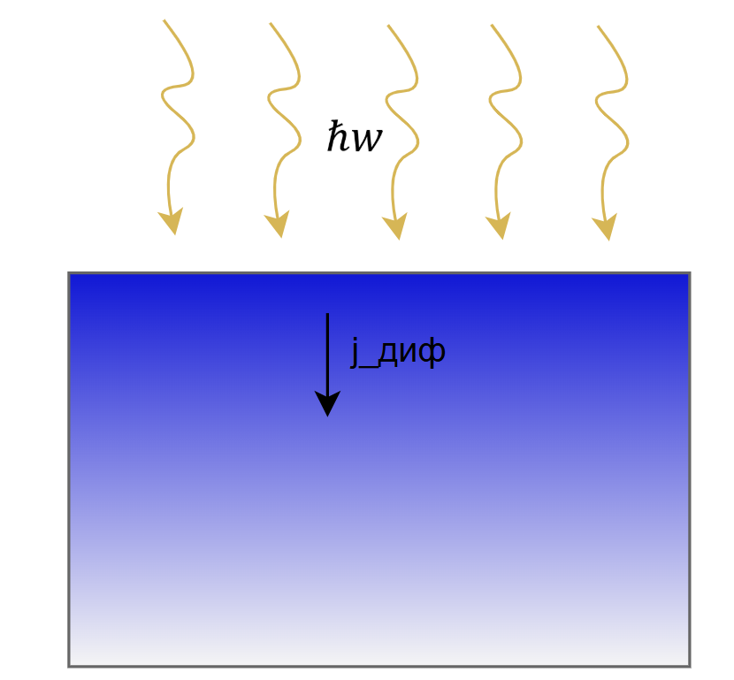

# Лекция 1. Диффузия и уравнение непрерывности.

**Уравнение диффузии**

Как мы знаем, частицы/электроны в некоей среде двигаются хаотически,
поэтому несмотря на их большие тепловые скорости итоговый поток частиц в
среднем равен 0.

Однако, это все верно только для случаев, когда концентрация везде
одинакова. В случае же, когда появляются неравномерно распределенные
частицы появляется так называемый диффузионный ток, который пытается
превратить неравномерное распределение в равномерное.

Для того, чтобы сделать сам диффузионный ток и уравнения диффузии
очевидными, решим модельную задачу (найти ток, зная параметры материала
и распределение концентрации)

$l - длина\ свободного\ пробега\ электрона$

$\tau - время\ жизни\ электрона\ в\ материале$

$< v > \  = \frac{l}{\tau} - средняя\ скорость\ электрона\ в\ материале$

Найдем ток частиц (число частиц на единицу площади за единицу времени
через площадку), который идет в положительном направлении

$$j_{+} = \frac{1}{6} \cdot n(x - l) \cdot < v >$$

Коэффициент $\frac{1}{6}$ возник в выражении выше из-за того, что
равновероятны все оси и $\frac{1}{3}$ всего потока идет на ось x, а на
$\frac{1}{2}$ он домножился потому, что мы рассматриваем поток в одном
из 2 направлений по этой оси.

$\ l - длина\ свободного\ пробега\ и\ более\ далекие\ частицы\ не\ долетают\ до\ x$

Рассуждая аналогично, запишем ток против оси OX:

$$j_{-} = \frac{1}{6} \cdot n(x + l) \cdot < v >$$

Запишем уравнение для итогового потока частиц через сечение с
координатой x

$$j = \ j_{+} - j_{-} = \frac{1}{6} \cdot < v > \cdot \left( n(x - l) - n(x + l) \right) \approx - \frac{l}{3} \cdot < v > \cdot \frac{\partial n}{\partial x} = \  - \frac{l^{2}}{3\tau} \cdot \frac{\partial n}{\partial x}\ $$

$\frac{\left( n(x + l) - n(x - l) \right)}{2l}$ мы заменили на $\frac{\partial n}{\partial x}$ потому, что $l\sim 10\ нМ$

$\frac{l^{2}}{3\tau} = D_{n}$ -  коэффициент диффузии

$$j_{диф} = \  - D_{n}\frac{dn}{dx} - уравнение\ диффузии$$

В дальнейших рассуждениях мы будем считать, что коэффициент диффузии
меняется гораздо слабее, чем концентрации, поэтому его можно считать
примерно постоянным.

**Уравнение непрерывности**

**Когда частицы не появляются из ниоткуда (нет генерации и рекомбинации)**

N -- число частиц

$$n - концентрация\ частиц$$

$$\mathrm{\Delta}N = n \cdot S \cdot dx = \ \left( j(x) - j(x + dx) \right) \cdot S \cdot \mathrm{\Delta}t$$

$Поделив\ на\ V \cdot \mathrm{\Delta}t\ получим$

$$\frac{\mathrm{\Delta}N}{S \cdot dx \cdot \mathrm{\Delta}t} = \frac{\mathrm{\Delta}n}{\mathrm{\Delta}t} = \frac{j(x) - j(x + dx)}{dx}$$

Получим уравнение непрерывности

$$\frac{dn}{dt} = \  - \frac{\partial j}{\partial x} - типичный\ случай\ для\ гидродинамики\ и\ электромагнетизма$$

**Когда частицы появляются и исчезают благодаря генерации/рекомбинации
электронов**

$$G_{total} = \frac{\partial n_{генер}}{\partial t} - генерация$$

$$r = \frac{\partial n_{рекомб}}{\partial t} - рекомбинация$$

Тогда, аналогичными рассуждениями уравнение преобразуется в:

$$\frac{\partial n}{\partial t} = \  - \frac{\partial j}{\partial x} + G_{total} - r$$

Электроны генерируются в полупроводнике 2 способами: тепловая генерация
и генерация от внешних источников (например, от света).

Тогда, несколько преобразуем наше уравнение для удобства использования

$$G_{total} = G_{темп} + G - генерация\ суммарная\ как\ температурная\ и\ внешняя$$

$$\frac{\partial n}{\partial t} = \  - \frac{\partial j}{\partial x} + G_{total} - r = \  - \frac{\partial j}{\partial x} + \left( G + G_{темп} \right) - r = - \frac{\partial j}{\partial x} + G - \left( r - G_{темп} \right)$$

$$\frac{\partial n}{\partial t} = \ \  - \frac{\partial j}{\partial x} + G - R$$

Рассмотрим ситуацию, когда тока в полупроводнике нет, генерации тоже
нет, то есть:

$$\frac{\partial n}{\partial t} = R$$

Разложим $\delta n = n - n_{0}$ в ряд Тейлора по времени

$$\delta n = n - n_{0} = \tau_{n} \cdot \frac{\partial n}{\partial t} + \ \tau_{n}^{2} \cdot \frac{\partial^{2}n}{\partial t^{2}} + \ldots \approx \ \tau_{n} \cdot \frac{\partial n}{\partial t}$$

$$R = \ \frac{\partial n}{\partial t}\  \approx \frac{\delta n}{\tau_{n}}$$

Где $\tau_{n}$ -- характерное время существования неравновесных
носителей заряда (в данном случае электронов) в материале (так
называемое время жизни электронов).

$$\frac{\partial n}{\partial t} = \  - \frac{\partial j}{\partial x} + G - R = \  - \frac{\partial j}{\partial x} + G - \frac{\delta n}{\tau_{n}}$$

**Задача 1. Про время жизни.**

Под действием света в полупроводнике возникли равномерно распределенные
избыточные носители заряда с концентрацией $\delta n$.

Концентрация неосновных носителей заряда составляет
$2.5 \cdot 10^{20}\ м^{- 3}$, а начальная скорость уменьшения
концентрации равна $2.8 \cdot 10^{24}\ м^{- 3}с^{- 1}$

Определите:\
1). Время жизни неосновных носителей заряда $\tau$\
2). Значение$\ \delta n$ через 2 мс после выключения источника света

**Решение**

На полупроводник падал свет, это дало энергию электронам, и их
концентрация возросла на $\delta n$.

После того, как свет вырубили, генерация пропала, электроны стали падать
обратно в валентную зону (осталась только рекомбинация):

$$\frac{\partial n}{\partial t} = - R = \  - \frac{\delta n}{\tau}$$

$$\delta n(t) = \ \delta n(0) \cdot \exp\left( - \frac{t}{\tau} \right)$$

$$\frac{\partial n}{\partial t}(0) = \frac{\delta n(0)}{\tau}$$

$$\tau = \frac{\delta n(0)}{\frac{\partial n}{\partial t}(0)} = \frac{2.5 \cdot 10^{20}}{2.8 \cdot 10^{24}} = 0.9 \cdot 10^{- 4}\ с = 90\ мкс$$

$$\delta n(t = 2\ мс) = \ \delta n(0) \cdot \exp\left( - \frac{2000\ мкс}{90\ мкс} \right) = \ 2.5 \cdot 10^{20} \cdot 2.23 \cdot 10^{- 10} = 5.6 \cdot 10^{10}\ м^{- 3}$$

**2 Закон Фика**

Если говорить честно, то 2 закон Фика - это всего лишь совмещение
уравнения диффузии и уравнения непрерывности, когда весь ток является
диффузионным. Данное уравнение полезно для нахождения распределения
концентрации электронов в базе диода/биполярного транзистора, что
помогает потом выразить ток через них.

$$\mathbf{\ }j = \ j_{диф} = \  - D_{n}\frac{dn}{dx}\ $$

$$\frac{\partial n}{\partial t} = \  - \frac{\partial j}{\partial x} + G - \frac{\delta n}{\tau_{n}}$$

Подставим j в уравнение непрерывности

Получим:

$$\frac{\partial n}{\partial t} = D_{n}\frac{\partial^{2}n}{\partial x^{2}}\  + G - \frac{\delta n}{\tau_{n}}\ $$

При отсутствии внешней генерации (не светим на полупроводник, не греем и
тд) получим

$$\frac{dn}{dt} = D_{n}\frac{d^{2}n}{dx^{2}} - \frac{\delta n}{\tau_{n}}$$

**Задача 2. Про инжекцию дырок.**

Из плоскости x=0 однородного полубесконечного (x≥0) полупроводника
n-типа производится стационарная инжекция дырок. Определите плотность
дырочного тока в точке x=0, если:

$\mathrm{\Delta}p(0) = 10^{13}\ см^{- 3}$, диффузионная длина дырок
составляет $L_{p} = 0.07\ см$, коэффициент диффузии дырок равен
$D_{p} = 49\frac{см^{2}}{c}$, а дрейф неравновесных носителей
пренебрежимо мал.

**Решение**

Так-как мы рассматриваем неменяющийся во времени процесс, то

$$\frac{\partial p}{\partial t} = 0$$

Тогда, 2 закон Фика превратится в:

$$D_{p} \cdot \frac{\partial^{2}p}{\partial x^{2}} = \  - R = \  - \frac{\delta p}{\tau}$$

$$\frac{\partial^{2}(\delta p)}{\partial x^{2}} = - \frac{\delta p}{D_{p}\tau} = \frac{\delta p}{L_{p}^{2}}\ $$

$$\delta p(x) = A \cdot \exp\left( - \frac{x}{L_{p}} \right) + B \cdot \exp\left( \frac{x}{L_{p}} \right)$$

Так как полупроводник полубесконечный при (x \> 0), то будет только
затухающая экспонента.

$$\delta p(x) = \ \delta p(0) \cdot \exp\left( - \frac{x}{L_{p}} \right)$$

По условию сказано, что неравновесный дрейф не учитывать, поэтому в
выражении для тока будет только диффузионная составляющая.

$$j_{p}(x = 0) = \  - e \cdot D_{p} \cdot \frac{\partial p}{\partial x} = e \cdot \frac{D_{p}}{L_{p}} \cdot \delta p(0) = 1.6 \cdot 10^{- 19} \cdot 49 \cdot \frac{10^{- 4}}{0.07 \cdot 10^{- 2}} \cdot 10^{19} = 11.2\frac{А}{м^{2}}$$
